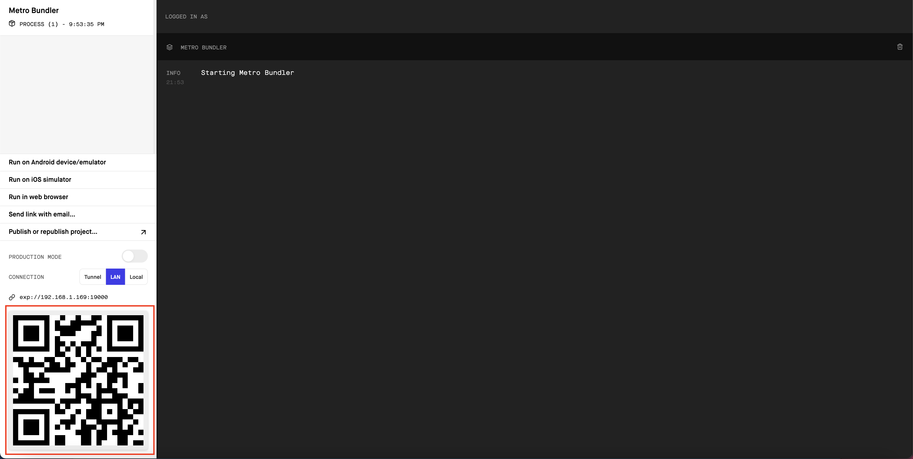

# Restaurant App
An app that I made in the process of learning React Native that displays nearby restaurants based on a keyword search.

## Installation
Install dependencies
```
npm install
```

## Usage
- Install Expo Go on your phone
- Run `npm start`
- Scan QR code that comes up with your phone to use the app
```
npm start
```

